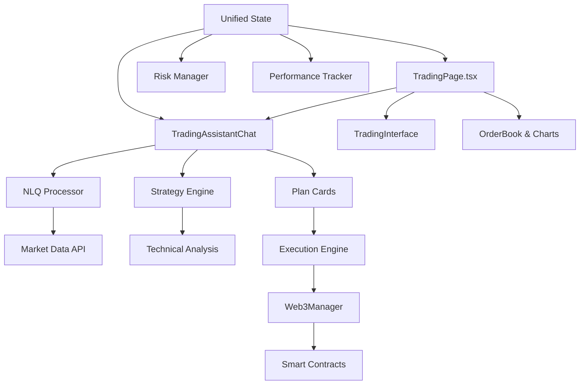

# RiverBit Architecture Summary

## 🏗️ System Architecture Overview

RiverBit is built as a modern React application with a microservice-inspired frontend architecture, featuring modular components, centralized state management, and seamless Web3 integration.

## 📦 Core Module Dependencies



## 🎯 Component Hierarchy

### 1. Main Application Structure
```
App.tsx
└── Web3Provider
    └── TradingPage
        ├── Chart Section (ReliableTradingView)
        ├── Trading Panel
        │   ├── Trade Tab (Traditional Interface)
        │   ├── Book Tab (Order Book)
        │   ├── Trades Tab (Trade History)
        │   └── AI Tab (🤖 Trading Assistant)
        └── Positions Panel
```

### 2. AI Trading Assistant Architecture
```
TradingAssistantChat
├── Chat Interface
│   ├── Message History
│   ├── Input with Voice Support
│   └── Quick Action Buttons
├── Plan Generation Pipeline
│   ├── NLQ Processing
│   ├── Strategy Analysis
│   └── Risk Validation
└── Execution Integration
    ├── Web3 Transaction
    ├── Progress Tracking
    └── Result Notification
```

## 🔄 Data Flow Architecture

### 1. User Query → AI Response Flow
```
User Input → NLQ Processor → Intent Recognition → Strategy Engine → Risk Validation → Plan Generation → UI Display
```

### 2. Trading Execution Flow  
```
Plan Selection → Pre-flight Checks → User Confirmation → Web3 Transaction → Status Updates → Performance Logging
```

### 3. Market Data Flow
```
Price APIs → Unified Data Layer → WebSocket Distribution → Component Updates → UI Refresh
```

## 🧠 AI System Architecture

### Core AI Components

#### 1. Natural Language Query Processor
```typescript
// Input Processing Pipeline
User Query → Text Parsing → Intent Classification → Symbol Extraction → Context Analysis → Structured Output

// Example Flow
"Should I buy BTC?" → 
  Intent: 'analyze' → 
  Symbol: 'BTC' → 
  Context: Current market data → 
  Output: TradingQuery object
```

#### 2. Strategy Engine Architecture
```typescript
// Multi-Strategy Framework
Market Data → Technical Analysis → Strategy Selection → Plan Generation → Risk Assessment → Final Plan

// Strategy Types
- Breakout Detection (MA crossover + volume)
- Support/Resistance Bounce (Bollinger + RSI)
- Momentum Continuation (Trend + pullback)
```

#### 3. Risk Management System
```typescript
// Risk Validation Pipeline
Trading Plan → Account Limits Check → Position Size Validation → Leverage Verification → Final Approval

// Risk Layers
- Account Level: Daily loss limits, total exposure
- Position Level: Max size, leverage limits
- Plan Level: R:R ratios, confidence thresholds
```

## 🔗 Web3 Integration Architecture

### Smart Contract Interaction
```typescript
// Contract Interaction Flow
User Action → Web3Manager → Contract Call → Transaction → Event Monitoring → UI Update

// Key Contracts
- RiverBitCore: Main trading logic
- USDC: Token operations
- Price Oracles: Market data feeds
```

### Transaction Management
```typescript
// Transaction Lifecycle
Initiation → Signing → Broadcasting → Confirmation → Event Processing → State Update

// Error Handling
- Network failures → Retry logic
- Gas estimation → Dynamic adjustment
- Slippage protection → Price validation
```

## 📱 State Management Architecture

### Zustand Store Structure
```typescript
// Centralized State Tree
TradingAssistantState {
  user: { address, preferences, onboarding }
  market: { prices, conditions, history }
  tradingPlans: { active, history, generation }
  opportunities: { alerts, scanning, filters }
  risk: { limits, positions, emergency }
  performance: { metrics, trades, analytics }
  ui: { tabs, notifications, modals }
}
```

### State Synchronization
```typescript
// Cross-Component Communication
Event Bus → State Updates → Component Re-renders → UI Sync

// Data Flow Patterns
- Market data: Push updates via WebSocket
- User actions: Immediate local state + API sync
- Trading plans: Optimistic updates + confirmation
```

## 🎨 UI/UX Architecture

### Design System
```scss
// Component Hierarchy
Base Components (ui/) → Composite Components → Page Components → Application

// Styling Architecture
Tailwind Base → Custom CSS Variables → Component Styles → Animation Layer
```

### Responsive Design Strategy
```typescript
// Breakpoint System
Mobile: < 768px → Compact layout, bottom sheets
Tablet: 768px - 1024px → Adaptive panels
Desktop: > 1024px → Full feature set

// Progressive Enhancement
Base functionality → Enhanced features → Advanced interactions
```

## 🔧 Performance Architecture

### Code Splitting Strategy
```typescript
// Lazy Loading
Main Bundle (342KB) → Core functionality
AI Assistant (77KB) → Loaded on demand
Chart Components → Dynamic imports
Utility Libraries → Selective imports
```

### Caching Architecture
```typescript
// Multi-Layer Caching
Browser Cache → Service Worker → Memory Cache → API Cache

// Cache Strategies
- Price data: 5-30s TTL based on volatility
- Historical data: 5min TTL
- User data: Session storage + periodic sync
```

## 🔒 Security Architecture

### Input Validation
```typescript
// Validation Pipeline
User Input → Schema Validation → Sanitization → Business Logic Validation → Execution

// Validation Types
- Type checking: TypeScript + Zod schemas
- Range validation: Min/max limits
- Format validation: Address, amount formats
```

### Transaction Security
```typescript
// Security Layers
User Intent → Multi-step Confirmation → Slippage Protection → Transaction Monitoring → Result Validation

// Protection Mechanisms
- Front-running protection
- MEV mitigation
- Gas optimization
- Error recovery
```

## 📊 Monitoring & Analytics

### Performance Monitoring
```typescript
// Metrics Collection
Component Renders → Performance Timing → Error Tracking → User Analytics

// Key Metrics
- Load times, interaction latency
- AI response times, accuracy rates
- Transaction success rates
- User engagement patterns
```

### Error Handling Architecture
```typescript
// Error Boundary System
Component Errors → Error Boundaries → Logging → User Notification → Recovery Actions

// Error Categories
- Network errors → Retry mechanisms
- Validation errors → User feedback
- Contract errors → Transaction reversal
- System errors → Graceful degradation
```

## 🚀 Deployment Architecture

### Build Pipeline
```bash
# Production Build Process
Source Code → TypeScript Compilation → Bundling → Optimization → Asset Generation → Deployment

# Optimization Steps
- Tree shaking: Remove unused code
- Code splitting: Lazy load components  
- Asset optimization: Image compression, CSS minification
- Bundle analysis: Size monitoring
```

### Environment Configuration
```typescript
// Environment Management
Development → Staging → Production

// Configuration Sources
- Environment variables
- Build-time constants
- Runtime configuration
- Feature flags
```

## 🔄 Integration Points

### External Services
```typescript
// API Integration Architecture
Price Data APIs ← Unified Price Service ← Application Components
Web3 Providers ← Web3Manager ← Trading Components  
Analytics Services ← Event Collectors ← User Interactions
```

### Plugin Architecture
```typescript
// Extensibility Framework
Core System → Plugin Interface → Strategy Plugins → Custom Implementations

// Plugin Types
- Trading strategies
- Risk management rules
- Data sources
- UI components
```

## 📈 Scalability Considerations

### Performance Scaling
- **Component virtualization** for large lists
- **Memoization** for expensive calculations
- **Background processing** for heavy operations
- **Progressive loading** for better UX

### Feature Scaling
- **Modular architecture** for easy feature addition
- **Plugin system** for custom strategies
- **Configuration-driven** behavior changes
- **A/B testing** infrastructure

### Data Scaling
- **Efficient data structures** for real-time updates
- **Pagination** for historical data
- **Compression** for large datasets
- **Edge caching** for global performance

This architecture provides a solid foundation for RiverBit's current capabilities while enabling future growth and enhancement.